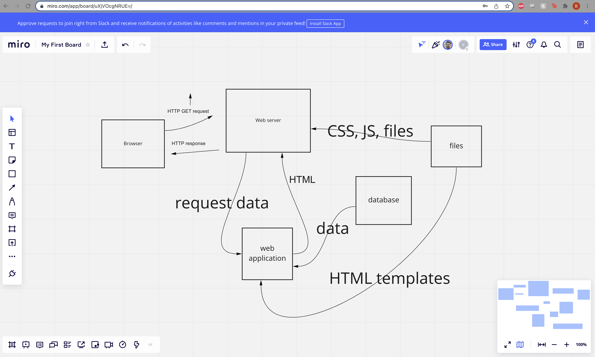
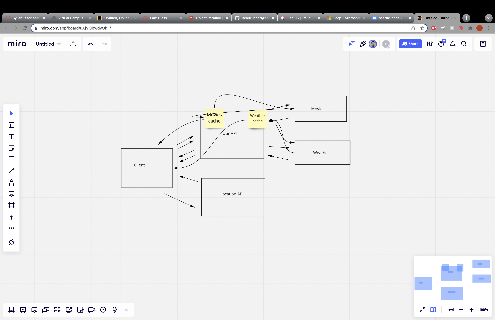
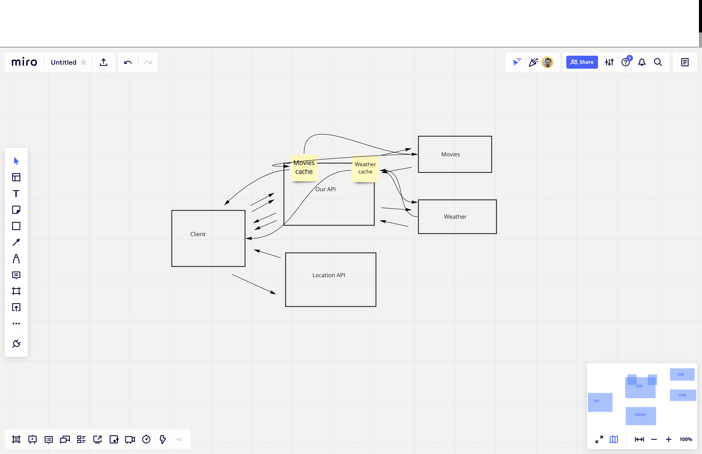

# City Explorer API

**Author**: Beau Hibbert
**Version**: 1.5.0 (increment the patch/fix version number if you make more commits past your first submission)

## Overview

This is a front end application that allows users to search for a city and get back related weather and movie data in order to find out more about the city.

## Getting Started

A user would have to start by cloning a repository down from Github. They would then need to run ```npm i``` to install all necessary npm packages. Next, they would need to obtain a weatherbit api key and add it to their .env file. Lastly they would need to run ```npm start``` in order to run their server.

## Architecture

The project is built using React/Javascript for its frontend, and node/express for its backend. The application is styled using scss. The client makes requests to custom routes on the backend's server which makes requests to weatherbit and locationIQ APIs.

## Change Log

12/6/21 - App scaffolded and locationIQ API requests (location and map) being made successfully.
12/7/21 - Fixes to map rendering and initial error handling added.
12/8/21 - Added weather component which sends weatherbit data to the client to be rendered out.
12/9/21 - Render weatherbit data to frontend and handle movie API querying on backend.

## Credit and Collaborations

https://locationiq.com/
https://www.weatherbit.io/
https://www.themoviedb.org/?language=en-US








Name of feature: Asynchronous code, and APIs

Estimate of time needed to complete: _____

Start time: _____

Finish time: _____

Actual time needed to complete: _____


Name of feature: Custom Servers with Node and Express
Overview

Estimate of time needed to complete: _____

Start time: _____

Finish time: _____

Actual time needed to complete: _____


Name of feature: APIs

Estimate of time needed to complete: _____

Start time: _____

Finish time: _____

Actual time needed to complete: _____


Name of feature: Refactoring into Modules

Estimate of time needed to complete: _____

Start time: _____

Finish time: _____

Actual time needed to complete: _____


Name of feature: Advanced Topics/Cache

Estimate of time needed to complete: _____

Start time: _____

Finish time: _____

Actual time needed to complete: _____